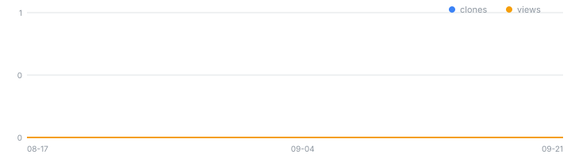

# kakao-book-mcp

<!-- mcp-name: io.github.rubatoyd/kakao-book-mcp -->

[](https://github.com/rubatoyd/kakao-book-mcp/actions/workflows/ci.yml)
[](https://github.com/rubatoyd/kakao-book-mcp/releases/latest)
[](https://github.com/rubatoyd/kakao-book-mcp/releases)

<!-- usage:start -->
> 📊 **사용량 통계** — 최근 14일 조회 **0**회(순 0) · 클론 **0**회(순 0) · 릴리스 다운로드 **0**건
>
> 
>
> <sub>2026-09-05 자동 집계됨 · 전체 이력 [`docs/usage.csv`](docs/usage.csv). GitHub 트래픽 API 14일 창을 영구 보존합니다.</sub>
<!-- usage:end -->

**카카오 Daum 책 검색(Daum Book Search)** Open API를 Claude, Cursor 등 MCP 클라이언트에서 바로 쓰는 **MCP 서버 + CLI 도구**.  
도서명·저자·출판사·ISBN 검색, 상세 서지 및 가격/할인율 정보 수집, 다중 키워드 일괄 수집 후 `xlsx`·`csv`·`json`·`sqlite` 파일로 내보냅니다.

> 📚 **자매 프로젝트**: [kci-openapi-mcp](https://github.com/rubatoyd/KCI_openAPI) (KCI 학술논문·인용지수) · [scienceON-mcp](https://github.com/rubatoyd/scienceON-mcp) (KISTI 과학기술 문헌) · [nl-openapi-mcp](https://github.com/rubatoyd/nl-openapi-mcp) (국립중앙도서관 국가서지)

---

## 주요 기능

1. **도서 검색 & ISBN 조회**:
   - 제목, 저자/역자, 출판사, ISBN 필드 타겟팅 검색
   - 10자리 / 13자리 ISBN 자동 정규화 및 조회
2. **조용한 절단(Quiet Truncation) 방지**:
   - 카카오 책 검색 API는 최대 50페이지 * 50건 = **2,500건**의 페이징 상한이 존재합니다.
   - 응답에 `total_count`, `pageable_count`, `is_end`, `truncated`, `cap_hit`을 함께 전달하여 부분 수집을 전수로 오인하지 않도록 안내합니다.
3. **대량 수집 & 다중 포맷 Export**:
   - 복수 검색어에 대한 자동 페이징 및 중복 제거(ISBN 기준)
   - 출판연도(`year_from`, `year_to`), 가격(`min_price`, `max_price`), 판매상태(`status`), 본문 키워드(`contains`) 클라이언트 필터링
   - `xlsx` (스타일 서식 적용), `csv` (한글 Excel 호환 UTF-8 BOM), `json` (원본 raw 포함), `sqlite` 동시 저장
4. **교육망/사내망 SSL 인터셉션 대응**:
   - `truststore` 내장으로 별도 인증서 등록 없이 OS 신뢰 저장소 자동 연동

---

## 도구 목록 (MCP Tools)

| 도구명 | 설명 | 주요 인자 |
| :--- | :--- | :--- |
| **`kakao_book_status`** | 인증키 유효성 점검 및 카카오 API 1회 프로브 호출 | 없음 |
| **`kakao_book_search`** | 키워드 도서 검색 | `query`, `target` (`title`\|`isbn`\|`publisher`\|`person`), `sort` (`accuracy`\|`latest`), `page`, `size` |
| **`kakao_book_isbn`** | ISBN 전용 상세 조회 (복수 ISBN 지원) | `isbn` (쉼표 구분 가능) |
| **`kakao_book_collect`** | 다중 검색어 대량 수집 및 파일 저장 | `terms`, `target`, `sort`, `max_records`, `year_from`, `year_to`, `min_price`, `max_price`, `status`, `contains`, `formats`, `out_dir`, `name` |

---

## 인증키 발급 및 설정 (1분 소요, 무료)

카카오 Daum 책 검색 API는 **무료이며 별도의 승인 심사 없이 즉시 발급**됩니다 (일일 기본 30,000건 쿼터 제공).

### 1. REST API 키 발급 방법
1. [카카오 디벨로퍼스 (developers.kakao.com)](https://developers.kakao.com) 접속 및 카카오 계정 로그인
2. 상단 메뉴의 **[내 애플리케이션]** ➡️ **[애플리케이션 추가하기]** 클릭
   * *앱 이름*: 임의 입력 (예: `kakao-book-mcp`)
   * *사업자명*: 임의 입력 (예: `개인` 또는 본인 이름)
3. 생성된 앱 클릭 ➡️ 좌측 **[앱 키]** (또는 [앱 설정] > [요약 정보])에서 **`REST API 키`** (32자리 16진수) 복사

### 2. 환경별 키 등록 방법
복사한 REST API 키를 사용 환경에 맞춰 설정합니다:

| 사용 환경 | 설정 위치 | 설정 방법 |
| :--- | :--- | :--- |
| **Claude Desktop (`.mcpb`)** | 확장 설치 시 팝업창 | `.mcpb` 파일을 Claude Desktop에 드래그 앤 드롭 후 나타나는 입력창에 키 붙여넣기 |
| **Claude Code** | `claude mcp add` | `--env KAKAO_API_KEY=YOUR_REST_API_KEY` 옵션으로 전달 |
| **Antigravity / Gemini CLI** | `mcp_config.json` | `env.KAKAO_API_KEY` 항목에 설정 |
| **CLI / 터미널 직접 실행** | OS 환경변수 / `.env` | Windows 환경변수 등록 또는 작업 폴더의 `.env` 파일에 `KAKAO_API_KEY=...` 작성 |

---

## 설치 및 MCP 등록

### 1. Claude Desktop

`%APPDATA%/Claude/claude_desktop_config.json` (Windows) 또는 `~/Library/Application Support/Claude/claude_desktop_config.json` (macOS):

```json
{
  "mcpServers": {
    "kakao-book": {
      "command": "uvx",
      "args": ["--from", "git+https://github.com/rubatoyd/kakao-book-mcp", "kakao-book-mcp"],
      "env": {
        "KAKAO_API_KEY": "YOUR_KAKAO_REST_API_KEY",
        "KAKAO_OS_TRUST": "1"
      }
    }
  }
}
```

### 2. Claude Code

```bash
claude mcp add kakao-book --env KAKAO_API_KEY=YOUR_REST_API_KEY -- uvx --from git+https://github.com/rubatoyd/kakao-book-mcp kakao-book-mcp
```

### 3. Gemini CLI / Antigravity

프로젝트 루트의 `.agents/mcp_config.json` 또는 전역 `~/.gemini/config/mcp_config.json`:

```json
{
  "mcpServers": {
    "kakao-book": {
      "command": "uvx",
      "args": ["--from", "git+https://github.com/rubatoyd/kakao-book-mcp", "kakao-book-mcp"],
      "env": {
        "KAKAO_API_KEY": "YOUR_KAKAO_REST_API_KEY",
        "PYTHONIOENCODING": "utf-8"
      }
    }
  }
}
```

### 4. Cursor / Windsurf / Cline

- **Command**: `uvx`
- **Args**: `["--from", "git+https://github.com/rubatoyd/kakao-book-mcp", "kakao-book-mcp"]`
- **Env**: `KAKAO_API_KEY=...`

---

## CLI 사용법

```bash
# 1. 상태 및 연결 점검
uvx --from git+https://github.com/rubatoyd/kakao-book-mcp kbook status

# 2. 도서 검색
uvx --from git+https://github.com/rubatoyd/kakao-book-mcp kbook search "인공지능" --target title --size 5

# 3. ISBN 조회
uvx --from git+https://github.com/rubatoyd/kakao-book-mcp kbook isbn 9788996991342

# 4. 대량 수집 및 엑셀/CSV/JSON 저장
uvx --from git+https://github.com/rubatoyd/kakao-book-mcp kbook collect --terms "딥러닝" "머신러닝" --max 100 --format xlsx csv json --out ./output
```

---

## 로컬 개발 및 실행

클라우드 동기화(OneDrive 등)와의 충돌 및 성능 저하를 방지하기 위해 가상환경은 프로젝트 외부(`C:\Users\rubat\.venvs\kakao-book`)에 구성되었습니다.

```bash
# 가상환경 생성 및 패키지 설치
uv venv C:\Users\rubat\.venvs\kakao-book
uv pip install --python C:\Users\rubat\.venvs\kakao-book -e . pytest

# 테스트 실행
C:\Users\rubat\.venvs\kakao-book\Scripts\pytest.exe

# CLI 실행
C:\Users\rubat\.venvs\kakao-book\Scripts\kbook.exe status
```

---

## 라이선스

MIT License.
